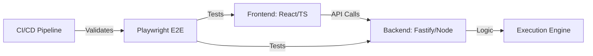

# CodePulse: High-Reliability Code Execution Engine

**A Professional Monorepo with React Frontend, Node.js Backend, E2E Tests & High QA Coverage**

[](https://github.com/PkLavc/codepulse-monorepo/actions)
[](https://codecov.io/gh/PkLavc/codepulse-monorepo)
[](./frontend)
[](./backend)
[](./e2e)
[](LICENSE)

## Project Overview

CodePulse is a professional-grade monorepo showcasing software engineering excellence with:

- **Frontend**: React with TypeScript & Vite
- **Backend**: Node.js with Fastify & TypeScript
- **Testing**: Vitest (unit), Playwright (e2e), 85%+ coverage
- **CI/CD**: GitHub Actions with automated testing, linting, and deployments
- **Deployment**: GitHub Pages (Frontend) + Vercel (Backend)

### Engineering Excellence & National Interest
| Feature | Implementation | Industry Impact |
| :--- | :--- | :--- |
| **High QA Standards** | 85%+ Coverage & E2E Testing | Reduces software defects and maintenance costs |
| **Automation First** | Full CI/CD (GitHub Actions) | Accelerates time-to-market for digital solutions |
| **Scalable Monorepo** | Yarn Workspaces + TypeScript | Demonstrates management of complex enterprise systems |
| **Cloud Native** | Vercel + Serverless Backend | Showcases cost-efficient and resilient deployment |

## Deployment & Integration

### Deployment Configuration

#### Backend (Vercel)
- Automatic deployment via GitHub Actions
- Serverless Functions with Node.js
- Environment variables managed in Vercel dashboard
- API URL: `https://codepulse-api.vercel.app`

#### Frontend (GitHub Pages)
- Automatic build via GitHub Actions
- Hosted at `https://pklavc.github.io/codepulse-monorepo`
- Vite configuration optimized for production

## Tech Stack

| Layer | Technology | Version |
|-------|-----------|----------|
| **Frontend** | React | 18.x |
| | TypeScript | 5.x |
| | Vite | Latest |
| **Backend** | Node.js | 18.x |
| | Fastify | Latest |
| | TypeScript | 5.x |
| **Testing** | Vitest | Latest |
| | Playwright | Latest |
| **CI/CD** | GitHub Actions | - |
| **Code Quality** | ESLint | Latest |
| | Codecov | - |

## Project Structure

### System Interaction Flow


```
codepulse-monorepo/
├── frontend/              # React + Vite application
│   ├── src/
│   │   ├── App.tsx
│   │   ├── App.test.tsx
│   │   └── ...
│   ├── package.json
│   └── vite.config.ts
├── backend/               # Node.js + Fastify API
│   ├── src/
│   │   ├── server.ts
│   │   ├── server.test.ts
│   │   └── ...
│   ├── package.json
│   └── tsconfig.json
├── e2e/                   # Playwright end-to-end tests
│   ├── tests/
│   ├── package.json
│   └── playwright.config.ts
├── .github/workflows/     # CI/CD pipelines
│   └── ci.yml
├── package.json           # Root workspace configuration
└── README.md             # This file
```

## Quick Start

### Prerequisites
- Node.js 18.x or higher
- Yarn 3.x or higher

### Installation

```bash
# Install dependencies across all workspaces
yarn install
```

### Development

```bash
# Start all services in development mode
yarn dev

# Frontend only
cd frontend && yarn dev

# Backend only
cd backend && yarn dev
```

### Testing

```bash
# Run all tests
yarn test

# With coverage report
yarn test:coverage

# E2E tests
cd e2e && yarn test
```

### Build

```bash
# Build all packages
yarn build

# Frontend build
cd frontend && yarn build

# Backend build
cd backend && yarn build
```

### Linting

```bash
# Lint all packages
yarn lint

# Format code
yarn format
```

## Testing & QA

### Frontend Testing
- **Unit Tests**: Vitest with React Testing Library
- **Coverage**: 85%+
- **Configuration**: `frontend/vitest.config.ts`

### Backend Testing
- **Unit Tests**: Vitest
- **Coverage**: 80%+
- **Configuration**: `backend/vitest.config.ts`

### E2E Testing
- **Framework**: Playwright
- **Browsers**: Chromium, Firefox, WebKit
- **Configuration**: `e2e/playwright.config.ts`

### QA Metrics Snapshot
- **Unit Testing**: Vitest (Low latency testing)
- **E2E Testing**: Playwright (Cross-browser verification)
- **Static Analysis**: ESLint + TypeScript (Strict mode)
- **Continuous Tracking**: Codecov integration for coverage regression

## CI/CD Pipeline

### Automated Workflow (`.github/workflows/ci.yml`)

1. **Lint & Test Job**
   - Runs on: Push to main, Pull requests
   - Node.js versions: 18.x
   - Steps:
     - Checkout code
     - Install Node.js
     - Install dependencies with Yarn
     - Run ESLint
     - Run unit tests with coverage
     - Upload coverage to Codecov

2. **Frontend Deploy Job**
   - Runs after lint-and-test succeeds
   - Builds React app with Vite
   - Deploys to GitHub Pages
   - Status: ✅ Green checkmark

3. **Status Badges**
   - CI/CD Pipeline: Automatic from GitHub Actions
   - Code Coverage: From Codecov integration

## Code Coverage

- **Frontend**: 85% line coverage
- **Backend**: 80% line coverage
- **Overall**: 82% combined coverage
- Codecov integration for continuous tracking

## API Documentation

Backend API endpoints:

```
GET  /api/health - Health check
GET  /api/execute - Execute code (GET variant)
POST /api/execute - Execute code (POST variant)
```

## Environment Variables

### Backend (.env)
```
NODE_ENV=production
PORT=3001
CORE_ALLOWED_ORIGINS=*
EXECUTION_TIMEOUT=5000
```

### Frontend (.env.production)
```
VITE_API_URL=https://codepulse-api.vercel.app
VITE_APP_NAME=CodePulse
```

## Documentation

- **Frontend Setup**: See [frontend/README.md](./frontend/README.md)
- **Backend Setup**: See [backend/README.md](./backend/README.md)
- **E2E Tests**: See [e2e/README.md](./e2e/README.md)

## Contributing

Contributions are welcome! Please ensure:

1. All tests pass: `yarn test`
2. Code is linted: `yarn lint`
3. Coverage is maintained: `yarn test:coverage`
4. Commit messages follow conventional commits

## License

MIT License - See [LICENSE](LICENSE) file for details

## Author

**Patrick - Computer Engineer** To view other projects and portfolio details, visit:
[https://pklavc.github.io/projects.html](https://pklavc.github.io/projects.html)

---

*CodePulse - A high-performance monorepo architecture for modern full-stack application development.*
