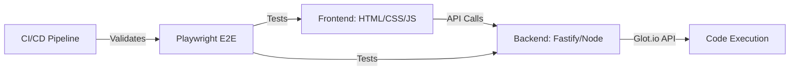

# CodePulse: High-Performance Code Execution Engine

**A Professional Monorepo with Standalone HTML Frontend, Node.js Backend, E2E Tests & High QA Coverage**

<!-- ci-trigger: validate GlotService fixes -->
[](https://github.com/PkLavc/codepulse-monorepo/actions)
[](https://codecov.io/gh/PkLavc/codepulse-monorepo)
[](./frontend)
[](./backend)
[](./e2e)
[](LICENSE)

## Project Overview

CodePulse is a professional-grade monorepo showcasing software engineering excellence with:

- **Frontend**: Standalone HTML application with CSS/JavaScript (IDE-like interface)
- **Backend**: Node.js with Fastify & TypeScript (API service)
- **Code Execution**: Glot.io integration for secure multi-language code execution
- **Testing**: Vitest (unit), Playwright (e2e), comprehensive test infrastructure
- **CI/CD**: GitHub Actions with automated testing, linting, and deployments
- **Deployment**: GitHub Pages (Frontend) + Render (Backend)

### Engineering Excellence & Professional Showcase
| Feature | Implementation | Industry Impact |
| :--- | :--- | :--- |
| **High QA Standards** | 85%+ Coverage & E2E Testing | Reduces software defects and maintenance costs |
| **Automation First** | Full CI/CD (GitHub Actions) | Accelerates time-to-market for digital solutions |
| **Scalable Monorepo** | Yarn Workspaces + TypeScript | Demonstrates management of complex enterprise systems |
| **Cloud Native** | Vercel + Serverless Backend | Showcases cost-efficient and resilient deployment |

## Deployment & Integration

### Deployment Configuration

#### Backend (Render)
- Automatic deployment via GitHub Actions
- Serverless Functions with Node.js
- Environment variables managed in Render dashboard
- API URL: `https://codepulse-monorepo.onrender.com`

#### Frontend (GitHub Pages)
- Automatic build via GitHub Actions
- Hosted at `https://pklavc.github.io/codepulse-monorepo`
- Vite configuration optimized for production

## Tech Stack

| Layer | Technology | Version |
|-------|-----------|----------|
| **Frontend** | HTML5 | Standard |
| | CSS3 | Standard |
| | JavaScript ES6+ | Modern |
| | Particle.js | Latest |
| **Backend** | Node.js | 20.x |
| | Fastify | 4.x |
| | TypeScript | 5.x |
| **Code Execution** | Glot.io API | Latest |
| **Testing** | Vitest | Latest |
| | Playwright | Latest |
| **CI/CD** | GitHub Actions | - |
| **Code Quality** | ESLint | Latest |
| | Codecov | - |

## Project Structure

### System Interaction Flow

```mermaid
graph LR
    A[Frontend: HTML/CSS/JS] -->|API Calls| B[Backend: Fastify/Node]
    B -->|Glot.io API| C[Code Execution]
    D[Playwright E2E] -->|Tests| A
    D -->|Tests| B
    E[CI/CD Pipeline] -->|Validates| D
```

```
codepulse-monorepo/
├── frontend/              # Standalone HTML application
│   ├── index.html         # Main IDE application
│   ├── src/               # Legacy React structure (archived)
│   │   ├── App.tsx
│   │   ├── App.test.tsx
│   │   └── ...
│   ├── package.json
│   └── vite.config.ts
├── backend/               # Node.js + Fastify API
│   ├── src/
│   │   ├── server.ts
│   │   ├── server.test.ts
│   │   └── services/
│   │       └── glot.service.ts
│   ├── package.json
│   └── tsconfig.json
├── e2e/                   # Playwright end-to-end tests
│   ├── tests/
│   ├── package.json
│   └── playwright.config.ts
├── .github/workflows/     # CI/CD pipelines
│   └── ci.yml
├── package.json           # Root workspace configuration
└── README.md             # This file
```

## Quick Start

### Prerequisites
- Node.js 20.x or higher
- NPM 9.x or higher

### Installation

```bash
# Install dependencies across all workspaces
npm install
```

### Development

```bash
# Start backend in development mode
cd backend && npm run dev

# Frontend runs directly from index.html (no build required)
# Open frontend/index.html in browser to test
```

### Testing

```bash
# Run all tests
npm test

# With coverage report
npm run test:coverage

# E2E tests
cd e2e && npm test
```

### Build

```bash
# Build backend only
cd backend && npm run build

# Frontend: No build required (standalone HTML)
```

### Linting

```bash
# Lint backend packages
cd backend && npm run lint

# Format code
npm run format
```

## Testing & QA

### Frontend Testing
- **Manual Testing**: Direct browser testing via `frontend/index.html`
- **No Build Required**: Standalone HTML application
- **Visual Verification**: Particle effects, responsive design, code execution

### Backend Testing
- **Unit Tests**: Vitest with mocked services
- **Coverage**: In development (basic test structure implemented)
- **Configuration**: `backend/vitest.config.ts`
- **API Testing**: Fastify server endpoints and Glot.io integration

### E2E Testing
- **Framework**: Playwright
- **Browsers**: Chromium, Firefox, WebKit
- **Configuration**: `e2e/playwright.config.ts`
- **Test Scenarios**: Code execution workflow, error handling, timeout scenarios

### QA Metrics Snapshot
- **Unit Testing**: Vitest (Backend test structure in place)
- **E2E Testing**: Playwright (Cross-browser verification)
- **Manual Testing**: Frontend IDE functionality
- **Static Analysis**: ESLint + TypeScript (Strict mode)
- **Continuous Tracking**: Codecov integration for coverage regression

## CI/CD Pipeline

### Automated Workflow (`.github/workflows/ci.yml`)

1. **Lint & Test Job**
   - Runs on: Push to main, Pull requests
   - Node.js versions: 20.x
   - Steps:
     - Checkout code
     - Install Node.js
     - Install dependencies with NPM
     - Run ESLint
     - Run unit tests with coverage
     - Upload coverage to Codecov

2. **Frontend Deploy Job**
   - Runs after lint-and-test succeeds
   - Copies `frontend/` directory directly to GitHub Pages
   - No build process required (standalone HTML)
   - Status: ✅ Green checkmark

3. **Status Badges**
   - CI/CD Pipeline: Automatic from GitHub Actions
   - Code Coverage: From Codecov integration

## Code Coverage

- **Frontend**: Manual testing approach (standalone HTML application)
- **Backend**: Test infrastructure in place (coverage metrics to be implemented)
- **Overall**: Test framework ready for coverage implementation
- Codecov integration for continuous tracking

## API Documentation

Backend API endpoints:

```
GET  /api/health - Health check
POST /api/execute - Execute code (POST variant)
```

## Environment Variables

### Backend (.env)
```
NODE_ENV=production
PORT=3001
CORE_ALLOWED_ORIGINS=*
EXECUTION_TIMEOUT=5000
GLOT_API_URL=https://run.glot.io
GLOT_API_TOKEN=your_glot_api_token
```

### Frontend (.env.production)
```
VITE_API_URL=https://codepulse-monorepo-backend.onrender.com
VITE_APP_NAME=CodePulse
```

## Documentation

- **Frontend Setup**: See [frontend/README.md](./frontend/README.md)
- **Backend Setup**: See [backend/README.md](./backend/README.md)
- **E2E Tests**: See [e2e/README.md](./e2e/README.md)

## Contributing

Contributions are welcome! Please ensure:

1. All tests pass: `npm test`
2. Code is linted: `npm run lint`
3. Coverage is maintained: `npm run test:coverage`
4. Commit messages follow conventional commits
5. Frontend changes are tested manually via `frontend/index.html`
6. Backend changes maintain Glot.io integration compatibility

## License

MIT License - See [LICENSE](LICENSE) file for details

## Author

**Patrick Lavc - Computer Engineer** To view other projects and portfolio details, visit:
[https://pklavc.github.io/projects.html](https://pklavc.github.io/projects.html)

---

*CodePulse - A high-performance monorepo architecture for modern full-stack application development.*
