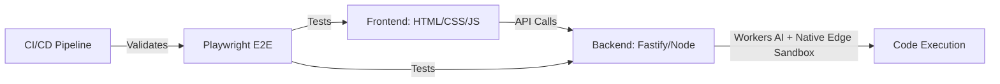

# CodePulse: High-Performance Code Execution Engine

**A Professional Monorepo with Standalone HTML Frontend, Node.js Backend, E2E Tests & High QA Coverage**

## Portfolio Case Study

Full case study: https://pklavc.com/projects/codepulse-monorepo/

This repository is part of my backend and developer tooling portfolio. It demonstrates monorepo structure, Node.js execution APIs, browser-based IDE workflow design, CI behavior, and Playwright coverage.

<!-- ci-trigger: validate Cloudflare Workers AI execution -->
[](https://github.com/PkLavc/codepulse-monorepo/actions)
[](https://codecov.io/gh/PkLavc/codepulse-monorepo)
[](./frontend)
[](./backend)
[](./e2e)
[](LICENSE)

## Project Overview

CodePulse is a professional-grade monorepo showcasing software engineering excellence with:

- **Frontend**: Standalone HTML application with CSS/JavaScript (IDE-like interface)
- **Backend**: Node.js with Fastify & TypeScript (API service)
- **Code Execution**: Hybrid execution on Cloudflare (native JS at the edge + deterministic AI simulation for other languages)
- **Testing**: Vitest (unit), Playwright (e2e), comprehensive test infrastructure
- **CI/CD**: GitHub Actions with automated testing, linting, and deployments
- **Deployment**: GitHub Pages (Frontend) + Cloudflare Workers (Backend)

### Engineering Excellence & Professional Showcase
| Feature | Implementation | Industry Impact |
| :--- | :--- | :--- |
| **High QA Standards** | 85%+ Coverage & E2E Testing | Reduces software defects and maintenance costs |
| **Automation First** | Full CI/CD (GitHub Actions) | Accelerates time-to-market for digital solutions |
| **Scalable Monorepo** | Yarn Workspaces + TypeScript | Demonstrates management of complex enterprise systems |
| **Cloud Native** | Cloudflare Workers + Dedicated Node.js Service | Showcases cost-efficient and resilient deployment |

## Deployment & Integration

### Deployment Configuration

#### Backend (Cloudflare Workers)
- Config: `backend/wrangler.toml`
- Entry point: `backend/src/worker.js`
- Deploy: `cd backend && npm run deploy`
- Local dev: `cd backend && npm run dev:worker`

**Required GitHub Secrets (for CI/CD auto-deploy):**
- `CLOUDFLARE_API_TOKEN` — Cloudflare API token with Worker edit permissions
- `CLOUDFLARE_ACCOUNT_ID` — your Cloudflare account ID

**DNS setup (one-time, in Cloudflare dashboard):**
Add a DNS record: `api-ide.pklavc.com` → type `AAAA`, value `100::`, Proxy enabled (orange cloud).

#### Backend (Cloudflare Workers)
- Automatic deployment via GitHub Actions (`cloudflare/wrangler-action`)
- Serverless Worker with native `fetch` API (no Node.js dependencies)
- Environment secrets managed via Cloudflare dashboard or `wrangler secret put`
- API URL: `https://api-ide.pklavc.com`
- Worker config: `backend/wrangler.toml`

#### Frontend (GitHub Pages)
- Direct deployment via GitHub Actions
- Hosted at `https://pklavc.github.io/codepulse-monorepo`
- No build process required (standalone HTML)

## Tech Stack

| Layer | Technology | Version |
|-------|-----------|----------|
| **Frontend** | HTML5 / CSS3 / Vanilla JS (Standalone) | Modern |
| | Particle.js | Latest |
| **Backend** | Node.js | 20.x |
| | Fastify | 4.x |
| | TypeScript | 5.x |
| **Code Execution** | Cloudflare Workers + Workers AI | Latest |
| **Testing** | Vitest | Latest |
| | Playwright | Latest |
| **CI/CD** | GitHub Actions | - |
| **Deployment** | Cloudflare Workers | Latest |
| **Code Quality** | ESLint | Latest |
| | Codecov | - |

## Project Structure

### System Interaction Flow

```mermaid
graph LR
    A[Frontend: HTML/CSS/JS] -->|API Calls| B[Backend: Fastify/Node]
    B -->|Workers AI + Native Edge Sandbox| C[Code Execution]
    D[Playwright E2E] -->|Tests| A
    D -->|Tests| B
    E[CI/CD Pipeline] -->|Validates| D
```

```
codepulse-monorepo/
├── frontend/              # Standalone HTML application
│   ├── index.html         # Main IDE application
│   ├── src/               # Visual assets (GIFs, Logos, Icons)
│   │   ├── code.gif
│   │   ├── doc.gif
│   │   ├── logo.png
│   │   ├── play.gif
│   │   └── return.gif
├── backend/               # Node.js + Fastify API
│   ├── src/
│   │   ├── server.ts
│   │   ├── server.test.ts
│   │   └── services/
│   │       └── glot.service.ts
│   ├── package.json
│   └── tsconfig.json
├── e2e/                   # Playwright end-to-end tests
│   ├── tests/
│   ├── package.json
│   └── playwright.config.ts
├── .github/workflows/     # CI/CD pipelines
│   └── ci.yml
├── package.json           # Root workspace configuration
└── README.md             # This file
```

## Quick Start

### Prerequisites
- Node.js 20.x or higher
- NPM 9.x or higher

### Installation

```bash
# Install dependencies across all workspaces
npm install
```

### Development

```bash
# Start backend in development mode
cd backend && npm run dev

# Frontend runs directly from index.html (no build required)
# Open frontend/index.html in browser to test
```

### Testing

```bash
# Run all tests
npm test

# With coverage report
npm run test:coverage

# E2E tests
cd e2e && npm test
```

### Build

```bash
# Build backend only
cd backend && npm run build

# Frontend: No build required. The frontend runs as a high-performance standalone HTML application.
```

### Linting

```bash
# Lint backend packages
cd backend && npm run lint

# Format code
npm run format
```

## Testing & QA

### Frontend Testing
- **Manual Testing**: Direct browser testing via `frontend/index.html`
- **No Build Required**: Standalone HTML application
- **Visual Verification**: Particle effects, responsive design, code execution

### Backend Testing
- **Unit Tests**: Vitest with mocked services
- **Coverage**: In development (basic test structure implemented)
- **Configuration**: `backend/vitest.config.ts`
- **API Testing**: Fastify/Worker endpoints with Cloudflare-native execution

### E2E Testing
- **Framework**: Playwright
- **Browsers**: Chromium, Firefox, WebKit
- **Configuration**: `e2e/playwright.config.ts`
- **Test Scenarios**: Code execution workflow, error handling, timeout scenarios

### QA Metrics Snapshot
- **Unit Testing**: Vitest (Backend test structure in place)
- **E2E Testing**: Playwright (Cross-browser verification)
- **Manual Testing**: Frontend IDE functionality
- **Static Analysis**: ESLint + TypeScript (Strict mode)
- **Continuous Tracking**: Codecov integration for coverage regression

## Code Execution

**Multi-language Support**: Python, JavaScript, Java, C++, C#, PHP, Go, Ruby

**Execution Flow**:
1. User writes code in textarea
2. Selects programming language from dropdown
3. Clicks "Run" button or uses Ctrl+Enter
4. Code sent to backend via fetch API
5. Backend executes JavaScript nativamente na borda da Cloudflare
6. Backend executa Python/Java/C++/C#/PHP/Go/Ruby via simulação determinística no Cloudflare Workers AI (`@cf/meta/llama-3-8b-instruct`)
7. Linguagens simuladas são exibidas no frontend com `*` (ex.: Python*, Java*)
6. Results displayed in output area

## CI/CD Pipeline

### Automated Workflow (`.github/workflows/ci.yml`)

1. **Lint & Test Job**
   - Runs on: Push to main, Pull requests
   - Node.js versions: 20.x
   - Steps:
     - Checkout code
     - Install Node.js
     - Install dependencies with NPM
     - Run ESLint
     - Run unit tests with coverage
     - Upload coverage to Codecov

3. **Backend Deploy Job**
   - Deploys `backend/src/worker.js` to Cloudflare Workers via `wrangler-action`
   - Requires `CLOUDFLARE_API_TOKEN` and `CLOUDFLARE_ACCOUNT_ID` in GitHub Secrets

3. **Status Badges**
   - CI/CD Pipeline: Automatic from GitHub Actions
   - Code Coverage: From Codecov integration

## Code Coverage

- **Frontend**: Manual testing approach (standalone HTML application)
- **Backend**: Test infrastructure in place (coverage metrics to be implemented)
- **Overall**: Test framework ready for coverage implementation
- Codecov integration for continuous tracking

## API Documentation

Backend API endpoints:

```
GET  /api/health - Health check
POST /api/execute - Execute code (POST variant)
```

## Environment Variables

### Backend (Cloudflare Workers — `backend/wrangler.toml`)
```
[ai]
binding = "AI"
```

### Frontend (.env — local dev only)
```
VITE_API_URL=https://api-ide.pklavc.com
VITE_APP_NAME=CodePulse
```

## Documentation

- **Frontend Setup**: See [frontend/README.md](./frontend/README.md)
- **Backend Setup**: See [backend/README.md](./backend/README.md)
- **E2E Tests**: See [e2e/README.md](./e2e/README.md)

## Contributing

Contributions are welcome! Please ensure:

1. All tests pass: `npm test`
2. Code is linted: `npm run lint`
3. Coverage is maintained: `npm run test:coverage`
4. Commit messages follow conventional commits
5. Frontend changes are tested manually via `frontend/index.html`
6. Backend changes maintain Cloudflare Workers + Workers AI execution compatibility

## 🚀 Roadmap

- [x] **Phase 1**: Core Engine & Monorepo Architecture
- [x] **Phase 2**: Security Audit & Environment Variable Enforcement
- [ ] **Phase 3**: n8n Automation & PostgreSQL Integration
- [ ] **Phase 4**: Advanced WebContainer support for local execution

## License

MIT License - See [LICENSE](LICENSE) file for details

## Security & Research

### Security Milestone 1: Completed ✅
**CP-SEC-001: Hardcoded API Token Exposure**
- **Status**: [COMPLETED ✅]
- **Finding**: Hardcoded Glot.io API token in source code
- **Impact**: Potential API abuse and service disruption
- **Mitigation**: Moved credentials to Environment Variables only
- **Date**: March 2026

### Security Research
This project serves as a security research platform for:
- **Static Analysis (SAST)**: ESLint, TypeScript strict mode, SonarQube
- **Dynamic Testing (DAST)**: Playwright, OWASP ZAP, custom scripts
- **Vulnerability Research**: RCE, command injection, container security
- **Secure Development**: Best practices implementation and validation

## Author

**Patrick Araujo - Security Researcher & Computer Engineer**  
**GitHub**: https://github.com/PkLavc  
**Portfolio**: [https://pklavc.github.io/projects.html](https://pklavc.github.io/projects.html)

---

*CodePulse - A high-performance monorepo architecture for modern full-stack application development.* 

[](https://github.com/sponsors/PkLavc)
